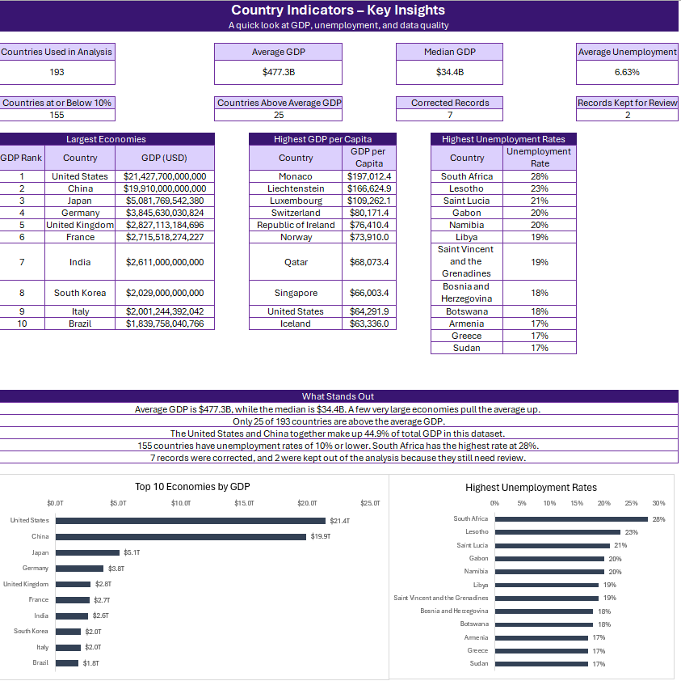
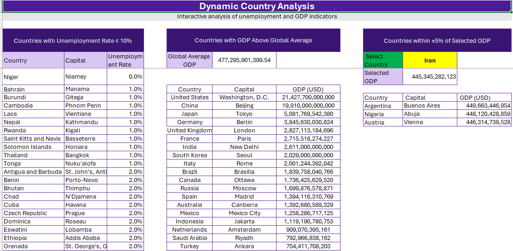

# Global Country Indicators Analysis in Excel

I built this project from Excel Exercise 03 in the Data Analyst training program at Tose'e Institute, under the guidance of Dr. Ayvazian.

The exercise was mainly about using `XLOOKUP`, `FILTER`, `SORT`, dropdown lists, and GDP ranking. While working on it, I found several problems in the source data, so I added a separate cleaning process before completing the analysis.

The final workbook includes the original exercise requirements, a clean data table, a correction log, validation checks, an insights sheet, and two charts.

## What the Exercise Asked For

The original exercise included six tasks:

1. Create a table of countries and their main indicators.
2. Select a country from a dropdown and return its information using `XLOOKUP`.
3. List countries with an unemployment rate of 10% or lower.
4. List countries with GDP above the global average.
5. Calculate the GDP rank for each country.
6. Find countries with GDP within ±5% of a selected country.

The original assignment is available in the [`docs`](docs/) folder.

## How I Worked on the Data

I kept the original dataset unchanged in `Raw_Data`.

Instead of editing incorrect values directly, I created a separate table in `Clean_Data`. This made it possible to keep the original values, apply verified corrections, and record the reason and source for every change.

I used three data quality statuses:

* `PASS`: no issue was found
* `CORRECTED`: the original value was replaced with a verified value
* `CHECK`: the row still needed review and was not used in the analysis

Seven values were corrected:

* ISO2 code for the Republic of the Congo
* ISO2 code for Eswatini
* ISO2 code for the Republic of Ireland
* Capital of Kiribati
* ISO2 code for North Macedonia
* Capital of Singapore
* Area of Sri Lanka

I also found two rows that appeared to repeat information from other countries:

* Palestine State repeated Palau's information.
* Vatican City repeated Uruguay's information.

I kept both rows in the workbook, marked them as `CHECK`, and excluded them from calculations.

## Workbook Sheets

| Sheet              | Description                                                          |
| ------------------ | -------------------------------------------------------------------- |
| `Raw_Data`         | Original data from the exercise                                      |
| `Clean_Data`       | Cleaned data, calculated columns, quality status, and correction log |
| `Country_Lookup`   | Country dropdown with the selected country's information             |
| `Dynamic_Analysis` | Dynamic lists based on unemployment and GDP                          |
| `Validation`       | Checks the data and compares analytical outputs                      |
| `Insights`         | Summary figures, rankings, findings, and charts                      |
| `Documentation`    | Explains how the workbook was built and how to use it                |

## Main Results

The original dataset contains 195 rows. After excluding the two rows marked as `CHECK`, 193 countries were used in the analysis.

Some of the main results are:

* Average GDP: **$477.3 billion**
* Median GDP: **$34.4 billion**
* Average unemployment rate: **6.63%**
* Countries with unemployment of 10% or lower: **155**
* Countries with GDP above the average: **25**
* Corrected records: **7**
* Records kept for review: **2**

The United States has the highest GDP in the dataset, while Monaco has the highest GDP per capita.

South Africa has the highest unemployment rate at 28%.

The United States and China together account for 44.9% of the total GDP in this dataset.

When Iran is selected, Argentina, Nigeria, and Austria fall within the ±5% GDP range.

## Validation

I added a separate validation sheet to check:

* Record counts between the raw and clean tables
* Missing required values
* Invalid ISO2 codes
* Duplicate ISO2 codes among usable records
* Invalid numeric values
* Unemployment rates outside the valid range
* Corrected and unresolved record counts
* The number of rows returned by the dynamic formulas

All checks in the final workbook return `PASS`.

## Screenshots

### Insights

### Dynamic Analysis

## Excel Features Used

* Excel Tables
* Structured references
* `XLOOKUP`
* `FILTER`
* `SORT`
* `CHOOSE`
* `COUNTIF` and `COUNTIFS`
* `AVERAGEIFS`
* `SUMPRODUCT`
* Dynamic arrays
* Dropdown lists
* Conditional formatting
* Formula-based validation
* Excel charts

## Project Files

* [Download the Excel workbook](Fatemeh_Kamrani_Global_Country_Indicators_Analysis.xlsx)
* [View the original assignment](docs/Excel_Proj03.pdf)

## Note

The dataset is a fixed snapshot and is not connected to a live source. GDP values are shown in US dollars, and area is measured in square kilometres.

The workbook uses `XLOOKUP` and dynamic-array formulas, so a recent version of Microsoft Excel is recommended.

## Author

**Fatemeh Kamrani**
